# Meal Recommendation AI 🍴🤖

## Description  
Developed a **Meal Recommendation AI** application using Flutter and Dart, designed to provide personalized meal suggestions based on user preferences and dietary requirements. The app leverages machine learning models and Gemini AI to analyze user inputs and recommend tailored meals. Built with a strong focus on **Clean Architecture** and **Design Patterns**, the application ensures maintainability, scalability, and performance optimization. It integrates **Firebase** for secure real-time data storage, **Hive** for offline storage, and **secure shared preferences** for managing sensitive user data. Utilizing **Bloc** state management, the app provides seamless functionality and API connections for dynamic meal data retrieval. The intuitive and responsive user interface enhances engagement, offering real-time updates and an exceptional user experience.

Key highlights include:
- **Personalized Meal Suggestions** using AI  
- **User Preferences Analysis** for tailored recommendations  
- **Cubit State Management** for efficient app functionality  
- **Clean Architecture** for scalability and maintainability  
- **Firebase Integration** for secure real-time data storage  
- **Hive for Offline Storage**  
- **Secure Shared Preferences** for managing sensitive user data  

## Features  
✅ **Meal Suggestions** – Personalized meal recommendations based on user inputs  
✅ **Dietary Requirements** – Customize meals based on dietary preferences  
✅ **Real-time Data** – Get live meal updates with dynamic API connections  
✅ **Offline Storage** – Store meal data locally with Hive  
✅ **Authentication** – Secure user login and registration via Firebase  
✅ **Saved Meal Preferences** – Save and view past meal suggestions  

## Technologies Used  
- **Flutter** (Dart)  
- **Cubit** for state management  
- **Firebase** for real-time data storage and authentication  
- **Hive** for offline data storage  
- **Gemini AI** for personalized meal recommendation analysis  
- **Bloc** for state management  
- **API Integration** for dynamic meal data retrieval  
- **Secure Shared Preferences** for storing sensitive user data  

## Screen Shots 

<!-- Image Grid Section -->

  

    
  

  

    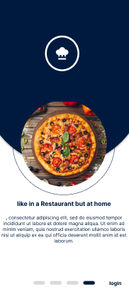
  

  

    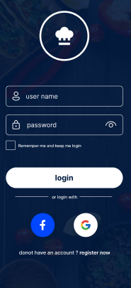
  

  

    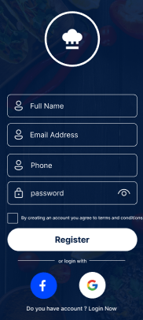
  

  

    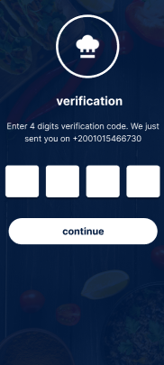
  

  

    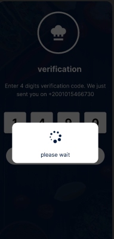
  

  

    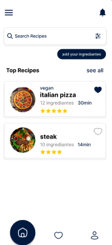
  

  

    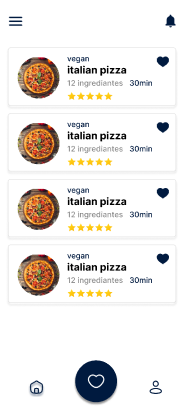
  

  

    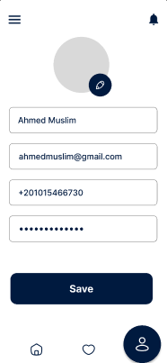
  

  

    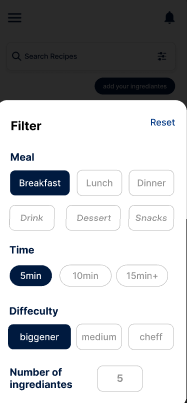
  

  

    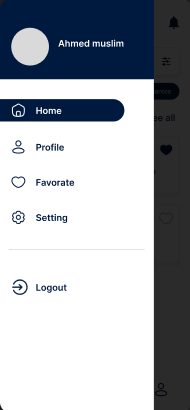
  

  

    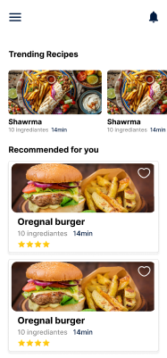
  

  

    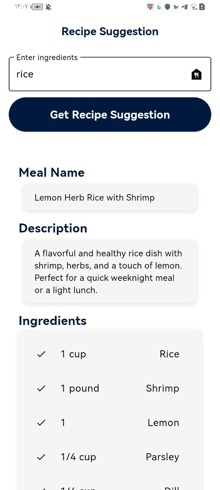
  

  

    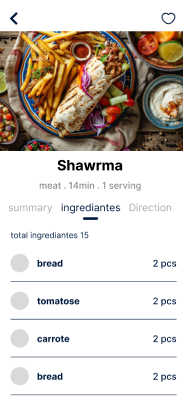
  

  

    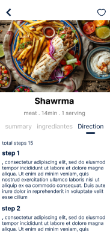
  

